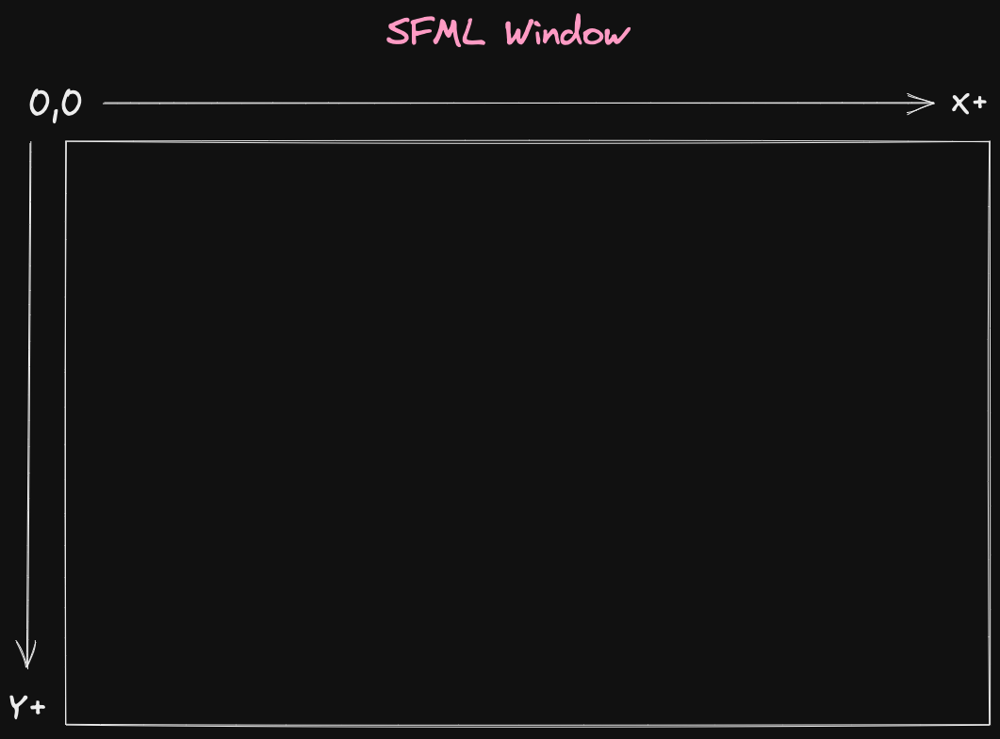
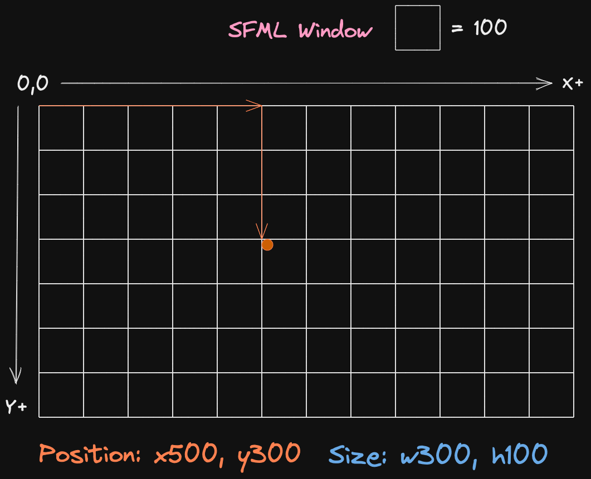
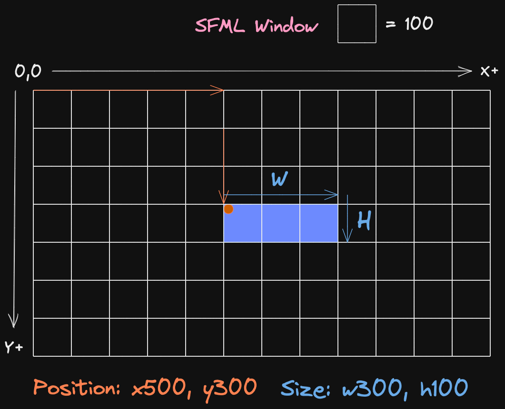
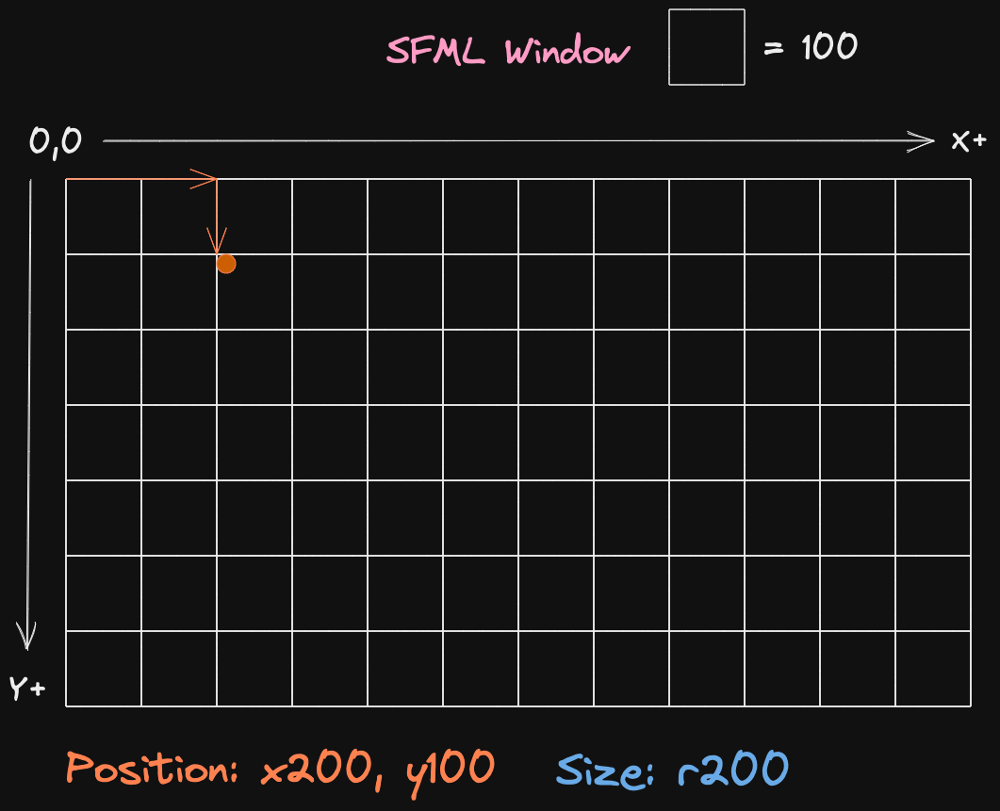
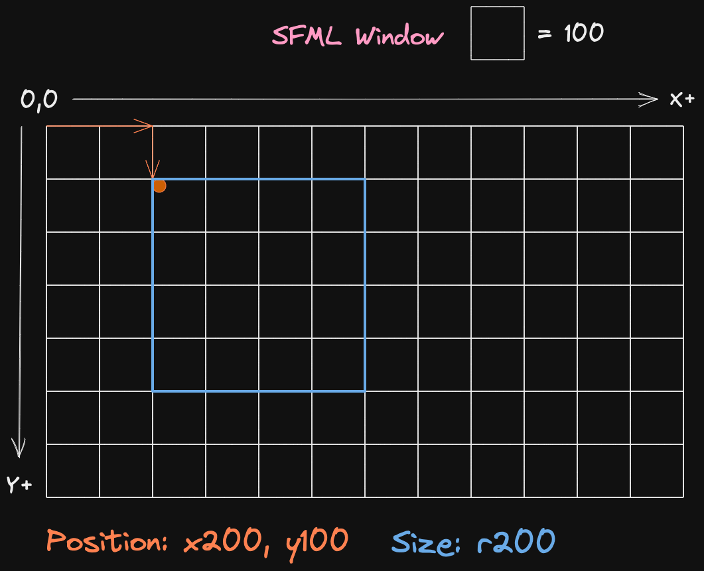
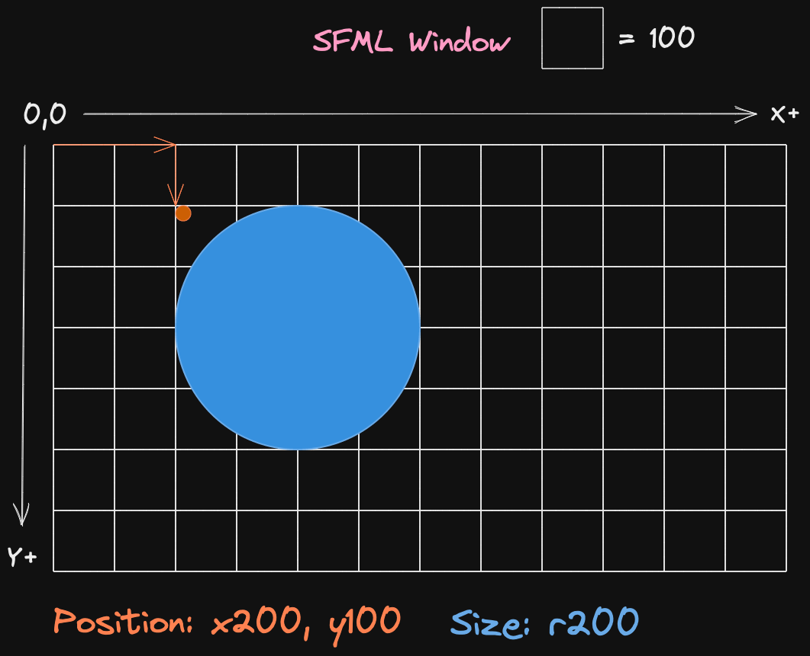

# 📝 Notes

## Compiling with graphics

> requires sfml installed

```bash
brew install sfml pkg-config
```

```bash
g++ *.cpp $(pkg-config --libs --cflags sfml-window sfml-system sfml-graphics) -o main
```

## Understanding 2D SFML Graphics

SFMl works off of coordinate system. Starting in the **TOP LEFT** of the window.
X - Coordinate increase from **TOP LEFT** to the right
Y - Coordinate increases from **TOP LEFT** to the bottom



When shapes are being drawn the coordinate system will always start the drawing of the shape from the **TOP LEFT** corner of the shape.

> As an example take the following data for a shape.

**Coordinates**

- X: 500
- Y: 300

**Size**

- W: 300
- H: 100

First step would be to find the starting position based off the coordinates provided.



From here we can begin to draw our shape based on the size provided.



Now this is fine for a box shape. Let's take a look at a circle.

> For this example we will be using the following data

**Coordinates**

- X: 200
- Y: 100

**Size**

- R: 200
  _R_ meaning radius of the circle

First step is the same as the last. Find the starting position to draw the shape.



With circles a bounding box is made to determine the size of the circle based on the radius.



After we have our circle within the bounds of that box.



## Bounding Box

Now every shape has a bounding box when drawn in SFML. This bounding box can be obtained with the following code.

```c++
shape.getLocalBounds();
```

This does the following:

- provide access to `.top .left .width .height`
- gives the LOCAL position of the (top,left) of the rectangle
- LOCAL pos means it is relative to shape.getPosition(), not the window
- this works as well for the (width, height) size of the rectangle

This bounding box can be used to determine when shapes are on the screen and if they are interacting with other bounding boxes.
