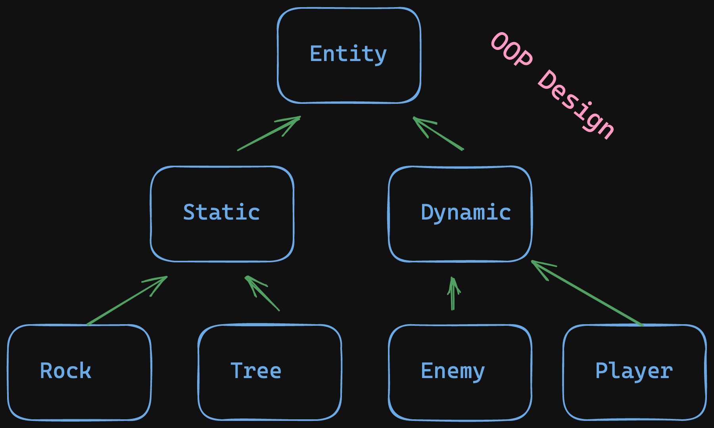
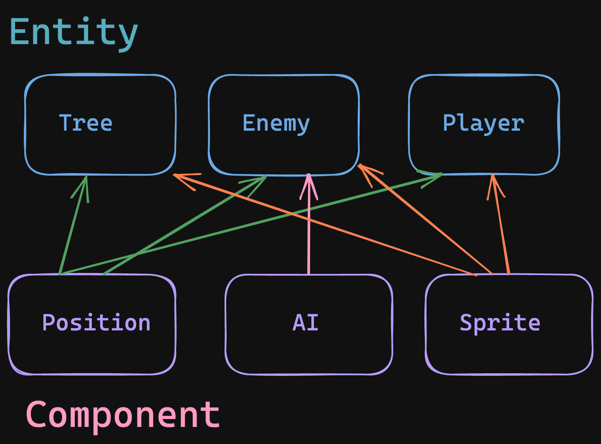

# 📝 Notes

ECS
Stands for:

- Entities
- Components
- Systems

ECS is actually a software design paradigm and to understand it we can look at Object Oriented Design.

Large AAA games can and have been made with OOD for years.
ECS is a step beyond that some beleive that it is better but it is opinion either way.

### Object Oriented

- OOP / OOD Design helps us manage data/code
- Follows all the base rules of OOP
  - Inheritance
  - Encapsulation
  - Abstraction
  - etc

IE, If I wanted to have entities in my game you would make a base class of Entity that holds properties. For example things like (x,y) positions. You would then create subclasses for more specific properties.



#### Entity-Component Relationship

- Entity: object in game that holds components
- Component: properties that can attach to Entities
  - Examples
    - Position, Speed
    - Bounding Box
    - Health, Weapon, Damage



## ECS Game Programming

ESC uses composition-based design

- Entity: Any object in the game
  - Player, Platform, Tile, Bullet, Enemy
- Component: Properties attached to entities
  - Position, Texture, Animation, Health, Gravity
  - Componnents are **PURE DATA** (they do not hold functionality)
- System: Code/ logic that drives behavior
  - Movement, Rendering, Sound, Physics

Some rules to follow:

- Entity can have any amount of components attached to it.
- AT MOST each entitity should only have one of a component type. IE: One Speed, One Position and no more than that

#### Game Architecture

- Game Engine
  - Scene
    - Systems
    - Entity Manager
      - Entity
        - Component

### What is a Component?

- An ECS component is just DATA
  - (might be some logic in the constructor)
  - No helper functionality within components
- A component class has some intuitive meaning to an Entity which contains it
  - IE: Position, Gravity, Health

### What is an Entity

- Any object in the game
  - usually any object with a position
- No unique functionality, typically just stores a number of Components
- Stores at most 1 of each component type
- How components are stored and used within an Entity can be a complex topic

### Component Storage Options

1. Since there will be at most one of every component, store a variable for each component type.
2. Store a single container of Components. We can then use addComponent/getComponent function for more generality than individual variables

### Component Implementation Notes

- different component class for each component we want to implement
- Naming: class CComponentName

### Starting Architecture

#### Entity

```c++
class Entity
{
  public:
  // these are the stored components
    std::shared_ptr<Ctransform> cTransform;
    std::shared_ptr<CName> cName;
    std::shared_ptr<CShape> cShape;
    std::shared_ptr<CBBox> cCBBox;
    Entity() {}
}
```

#### Declaring an Entity

```c++
int main()
{
  std::vector<Entity> entities;
  Vec2 p(100, 200), v(10,10);
  Entity e;
  e.cTransform = std::make_shared<Ctransform>(p, v);
  e.cName = std::make_shared<CName>("Red Box");
  e.cShape = std::make_shared<CShape>(args);
  entities.push_back(e);
  doStuff(entities); // generic system see below
}
```

#### Using Entities

```c++
void doStuff(std::vector<Entity> & entities)
{
  for(auto & e : entities)
  {
    // dot notation to access props but -> for pointers
    e.cTransform->pos += e.cTransform->velocity;
    e.cShape->shape.setPosition(e.cTransform->pos);
    window.draw(e.cShape->shape);
  }
}
```

#### System Example

Here is an example of a movement system.

```c++
void sMovement(std::vector<Entity> & entities)
{
  for(auto & e : entities)
  {
    // dot notation to access props but -> for pointers
    e.cTransform->pos += e.cTransform->velocity;
  }
}
```
